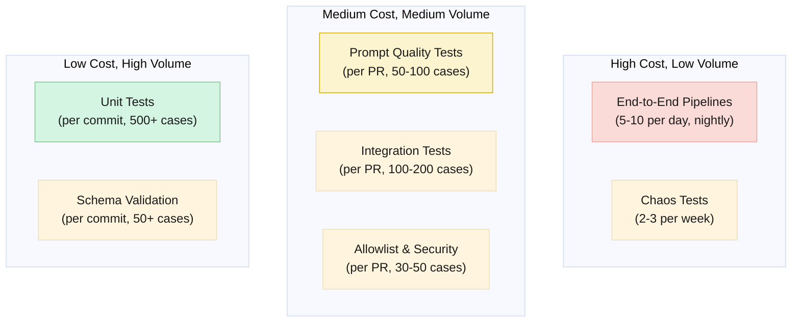
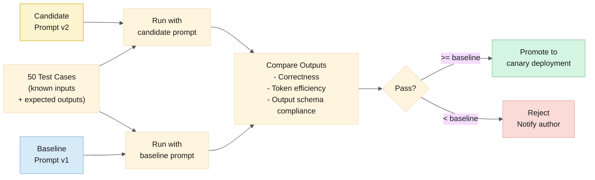
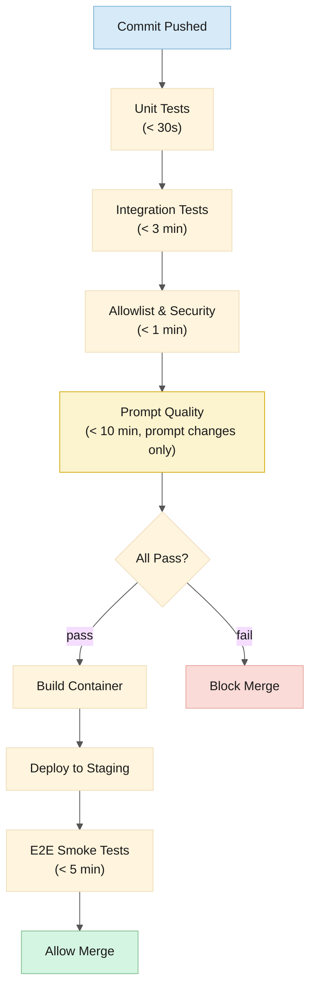

# Testing Strategy

> **Date:** 2026-06-14\
> **Status:** Active\
> **Purpose:** How to test every layer of the framework — from prompt quality to pipeline recovery.

______________________________________________________________________

## ⚠️ Coverage Mandate

**100% test coverage is non-negotiable.** Every component, every path, every agent must have passing tests before it can be merged or deployed.

| Rule | Enforcement |
|---|---|
| **No code without tests.** | Every new file must have a corresponding test file. |
| **No PR without passing tests.** | CI blocks merge if any test fails. |
| **No deployment without coverage.** | Coverage gates block deployment if thresholds are not met. |
| **Coverage thresholds by layer:** | |
| Agent definitions (`agents/*.md`) | Identity tests must pass for every agent |
| Orchestrator skill | Intent classification tests must cover all 6 intents |
| Toolshed (`mcp-servers/toolshed/`) | `cargo test` must pass with 100% of tests green |
| Slash commands | Command parsing tests must cover all 3 commands |
| Session hooks | Hook scripts must execute without errors in CI |
| Integration (walking skeleton) | End-to-end test must pass nightly |

> **If a test fails, the build is broken. Fix the test before adding new code.**

### CI Enforcement Rules

Beyond coverage thresholds, the following rules are enforced at the CI/CD pipeline level:

| Rule | Enforcement |
|---|---|
| **No merge on red.** | CI blocks merge if any test fails. The merge button is disabled. No exceptions without a written exemption. |
| **Fix the root cause.** | No disabling tests. No lowering thresholds. No `#[ignore]` without a written exemption approved by a maintainer or QA lead. Tests can only be modified to fix the test, not to make it pass. |
| **Re-run the full pipeline after fix.** | A code fix must trigger a full pipeline re-run. Partial re-runs or "the last run was green, trust it" are not acceptable. The full suite must pass against the exact commit being merged. |
| **Maintainer/QA approval required before merge.** | Even with a green pipeline, a human maintainer or QA reviewer must approve the PR. The approval confirms: (a) the right tests passed, (b) no tests were improperly modified, and (c) coverage thresholds are met. |
| **Linting must pass.** | Every language has a lint gate: `cargo clippy` (Rust), `markdownlint` (Markdown), `yamllint` (YAML), `shellcheck` (bash). No warnings allowed. Lint failures block merge the same as test failures. |

### 🔄 The Ralph Wiggum Loop

If a test fails during build, the code enters the **Ralph Wiggum loop** — an enforced CI gate that refuses to let failing code through:

```text
  ┌─────────────────────────────────────────┐
  │                                         │
  │  Code pushed ──▶ CI runs tests          │
  │                    │                    │
  │                    ├── ALL PASS ──▶ ✅ Merge allowed
  │                    │                    │
  │                    └── ANY FAIL ──▶ ❌ Blocked
  │                                         │
  │  ┌──────────────────────────────────┐   │
  │  │  Failed code goes back to dev    │   │
  │  │  Dev fixes the code              │   │
  │  │  Dev pushes fix                  │   │
  │  │  CI runs tests again             │   │
  │  └──────────────┬───────────────────┘   │
  │                 │                       │
  │                 └──▶ Back to top ──────▶┘
  │
  └── Repeats until ALL tests pass. Nothing escapes the loop without green tests.

  "I'm helping!" — Ralph Wiggum
```

**The loop is mandatory.** There is no skip button, no override, no "merge anyway." Code exits the loop only when every test passes. This applies at every level: local `cargo test`, CI pipeline, and deployment gates.

______________________________________________________________________

## Table of Contents

1. [Testing Pyramid](#testing-pyramid)
1. [Unit Tests](#unit-tests)
1. [Integration Tests](#integration-tests)
1. [Prompt Quality Tests](#prompt-quality-tests)
1. [End-to-End Pipeline Tests](#end-to-end-pipeline-tests)
1. [Allowlist & Security Tests](#allowlist--security-tests)
1. [Performance Tests](#performance-tests)
1. [Chaos Tests](#chaos-tests)
1. [Cross-Platform Parity Tests](#cross-platform-parity-tests)
1. [Test Infrastructure](#test-infrastructure)
1. [CI Integration](#ci-integration)

______________________________________________________________________

## Testing Pyramid



______________________________________________________________________

## Unit Tests

### What to test

| Component | Test | Mock |
|---|---|---|
| **Orchestrator: Intent Classifier** | Classify 50 sample messages → correct intent | LLM response mocked |
| **Orchestrator: Task Decomposer** | Decompose 20 complex intents → correct DAG | LLM response mocked |
| **Orchestrator: Result Collector** | Validate valid JSON → pass. Validate invalid JSON → retry. | Minion output mocked |
| **Orchestrator: Correlation ID Generator** | Generate IDs → correct format `corr_uuid.N.server-NNN` | — |
| **Toolshed: Allowlist Check** | Allowed tool → pass. Disallowed tool → blocked + security event. | — |
| **Toolshed: Rate Limiter** | Within limit → pass. Exceed limit → throttled. Window reset → pass again. | — |
| **Toolshed: Pre/Post Logger** | Log written to Table Storage mock. Correct fields populated. | Table Storage mocked |
| **Toolshed: Circuit Breaker** | Consecutive failures → open. Timeout → half-open. Success → close. | MCP connection mocked |
| **Minion: Output Schema** | Every minion output validates against its JSON schema | — |

### Example: Intent Classifier Unit Test

```typescript
describe('Intent Classifier', () => {
  const testCases = [
    {
      input: "Review PR #342",
      expected: { intent: "code_review", complexity: "simple", platform: null }
    },
    {
      input: "Fix INC00421 and create a PR",
      expected: { intent: "ticket_fix_pr", complexity: "complex", platform: null }
    },
    {
      input: "What's the status of AB#1234?",
      expected: { intent: "ticket_lookup", complexity: "simple", platform: "ado" }
    },
    {
      input: "Summarize all open Sev-1 incidents",
      expected: { intent: "ticket_summary", complexity: "simple", platform: null }
    },
    {
      input: "Is this SQL query vulnerable?",
      expected: { intent: "security_audit", complexity: "simple", platform: null }
    }
  ];

  testCases.forEach(({ input, expected }) => {
    it(`classifies "${input}" → ${expected.intent}`, async () => {
      // Mock LLM response with the expected classification
      mockLLMResponse({
        intent: expected.intent,
        complexity: expected.complexity,
        platform: expected.platform
      });
      
      const result = await classifier.classify(input, { channel: 'teams' });
      expect(result.intent).toBe(expected.intent);
      expect(result.complexity).toBe(expected.complexity);
      expect(result.platform).toBe(expected.platform);
    });
  });
});
```

______________________________________________________________________

## Integration Tests

### What to test

| Test | Setup | Verification |
|---|---|---|
| **Orchestrator spawns a real minion** | Real Goose delegate with mock toolshed | Minion completes, returns JSON, orchestrator collects |
| **Minion calls toolshed → MCP mock** | Real toolshed, mock MCP server | Tool call logged, allowlist checked, result returned |
| **Session state persists across minions** | Real SQLite | Session record created, minion run recorded, recoverable |
| **Service Bus enqueue/dequeue** | Real Service Bus (dev namespace) | Message sent, received by subscription, session ordering |
| **Bot adapter → Orchestrator → Bot adapter** | Real Slack/Teams bot, mock orchestrator | Message received, response rendered correctly |
| **Human approval flow** | Orchestrator posts approval prompt, operator responds | Approval recorded, pipeline resumes or aborts |

### MCP Mock Server

For integration tests, we run a lightweight MCP mock server that:

- Responds to `health_check` with configurable status (healthy, degraded, down)
- Returns pre-recorded responses for known tool calls (e.g., `get_pr_diff(342)` returns a canned diff)
- Simulates latency (`?latency=2000` returns in 2 seconds)
- Simulates errors (`?error=429` returns rate limit)
- Logs all received calls for assertion

```bash
# Start mock servers for integration tests
mcp-mock --server github --port 9001 --scenarios scenarios/github.yaml &
mcp-mock --server azure-devops --port 9002 --scenarios scenarios/ado.yaml &
mcp-mock --server servicenow --port 9003 --scenarios scenarios/servicenow.yaml &
```

### Example: Pipeline Integration Test

```typescript
describe('ticket→fix→pr pipeline', () => {
  it('completes successfully with mock MCP servers', async () => {
    // Setup: canned ServiceNow incident + Azure DevOps PR response
    mockServiceNow.addScenario('query_incidents', { number: 'INC00421' }, cannedIncident);
    mockADO.addScenario('create_pr', { title: 'fix: auth timeout' }, cannedPR);
    
    // Execute
    const result = await orchestrator.handleMessage({
      text: "Fix INC00421 and create a PR",
      channel: 'teams',
      user: 'alice'
    });
    
    // Verify pipeline
    expect(result.minionRuns).toHaveLength(4);  // Ticket Analyst + Code Explorer + PR Crafter + Reviewer
    expect(result.status).toBe('completed');
    expect(result.linkedPR).toBe('https://dev.azure.com/org/Platform/_git/auth/pullrequest/892');
    
    // Verify tool calls were logged
    const toolCalls = await tableStorage.query({ partitionKey: result.correlationId });
    expect(toolCalls).toContainEqual(
      expect.objectContaining({ toolName: 'query_incidents', success: true })
    );
    expect(toolCalls).toContainEqual(
      expect.objectContaining({ toolName: 'create_pr', success: true })
    );
  });
});
```

______________________________________________________________________

## Prompt Quality Tests

This is the most important and hardest testing layer. A prompt change can silently degrade minion quality. We need automated evaluation before canary deployment.

### Evaluation Harness



### Test Case Bank

Each minion type has a bank of 50-100 test cases. These are real scenarios with known-good outputs.

```text
test-cases/
├── code-reviewer/
│   ├── pr-342-login-bug.md          # Input: PR diff + description
│   ├── pr-342-login-bug-expected.json # Expected: findings, severity, approval
│   ├── pr-567-sql-injection.md
│   ├── pr-567-sql-injection-expected.json
│   └── ... (48 more)
├── pr-crafter/
│   ├── fix-auth-timeout.md
│   ├── fix-auth-timeout-expected.json
│   └── ...
├── ticket-analyst/
│   ├── incident-login-broken.md
│   ├── incident-login-broken-expected.json
│   └── ...
└── security-auditor/
    ├── auth-module.md
    ├── auth-module-expected.json
    └── ...
```

### Quality Checks per Test Case

| Check | How | Threshold |
|---|---|---|
| **Output schema valid** | JSON Schema validation | Must pass 100% |
| **Severity agreement** | Candidate severity == baseline severity (for known bugs) | ≥90% agreement |
| **Finding recall** | Candidate found ≥ N of the expected findings | ≥80% recall |
| **Finding precision** | Candidate findings that are in expected set | ≥70% precision |
| **Token efficiency** | Candidate tokens ≤ baseline tokens * 1.2 | Must not exceed 120% |
| **No regression** | Candidate did not miss a known critical finding | Must pass 100% |

### Running Prompt Tests

```bash
# Run prompt quality tests for a specific minion
goose test prompt-quality \
  --minion code-reviewer \
  --candidate prompts/code-reviewer/v3.2.1.md \
  --baseline prompts/code-reviewer/v3.2.0.md \
  --test-cases test-cases/code-reviewer/ \
  --output results/code-reviewer-v3.2.1.json

# Output:
# ✅ Schema compliance: 50/50 (100%)
# ✅ Severity agreement: 47/50 (94%) — above 90% threshold
# ✅ Finding recall: 42/50 (84%) — above 80% threshold
# ✅ Finding precision: 38/50 (76%) — above 70% threshold
# ✅ Token efficiency: 0.94x baseline — under 1.2x threshold
# ✅ No regressions: 50/50 (100%)
#
# Verdict: PASS — promote to canary deployment
```

### Maintaining the Test Case Bank

- Test cases are added whenever a minion surfaces a novel bug or pattern
- When a human overrides a minion finding, that becomes a new test case: "the minion should NOT flag this"
- Test cases are PR-reviewed alongside prompts
- Stale test cases (code changed, finding no longer relevant) are removed

______________________________________________________________________

## End-to-End Pipeline Tests

Run nightly (or on demand) against a staging environment with real MCP servers pointed at test repos.

### Pipeline Test Scenarios

| # | Scenario | Verification |
|---|---|---|
| 1 | "Review PR #X" — GitHub | Review posted, findings present, correct severity |
| 2 | "Review PR #Y" — Azure DevOps | Same, ADO target |
| 3 | "What's the status of INC00421?" | Ticket details returned, cross-referenced |
| 4 | "Fix INC00421 and create a PR" — GitHub | PR created, linked to ticket, reviewed |
| 5 | "Fix AB#1234 and create a PR" — ADO | Same, ADO target with work item linking |
| 6 | Daily PR review (cron) — 3 PRs | Digest posted to Teams, all PRs reviewed |
| 7 | Human approval: "Approve merge" | PR merged after approval |
| 8 | Human approval: "Deny merge" | PR not merged |
| 9 | Human approval: timeout | PR remains open, escalation message posted |
| 10 | Multi-team isolation | Team A session cannot see Team B data |

### E2E Test Environment

```text
Staging environment:
├── Test GitHub repo: org/goose-framework-test
│   ├── Pre-seeded PRs (3 open, 2 with known bugs)
│   └── Known issues: SQL injection in test/unsafe-query.ts
├── Test Azure DevOps project: GooseFrameworkTest
│   ├── Pre-seeded work items + PRs
│   └── Known issues: auth timeout in src/auth/login.ts
├── Test ServiceNow instance (developer sandbox)
│   └── Pre-seeded incidents: INC00421 (auth bug), INC00823 (payment timeout)
└── Test Teams channel: "Goose E2E Tests"
```

______________________________________________________________________

## Allowlist & Security Tests

These **must pass 100%** before any deployment.

| # | Test | Expected |
|---|---|---|
| 1 | Ticket Analyst calls `github.create_pr` | Blocked — not in allowlist |
| 2 | Code Reviewer calls `servicenow.query_incidents` | Blocked — not in allowlist |
| 3 | PR Crafter reads files outside path scope | Blocked — path deny |
| 4 | Minion tries to call `github.delete_repo` | Blocked — tool in global denylist |
| 5 | Blocked call generates security event in log | Security event logged to Table Storage |
| 6 | Rate limiter blocks after 51st call in 1 minute | 51st call returns 429, logged as throttled |
| 7 | Rate limiter resets after window | 1st call of new window succeeds |
| 8 | Minion A cannot read Minion B's session data | SQLite row-level isolation |
| 9 | Unteamed session cannot access team-scoped workspaces | 403 on workspace boundary violation |

______________________________________________________________________

## Performance Tests

| Test | Threshold | Measurement |
|---|---|---|
| Intent classification latency | p95 < 500ms | Wall clock from message receipt to intent return |
| Simple query end-to-end | p95 < 5 seconds | Slack message → response posted |
| Complex pipeline end-to-end | p95 < 3 minutes | "Fix INC00421" → PR created + reviewed |
| Tool call logging overhead | < 2ms per call | Added latency from pre/post-log writes |
| 100 concurrent sessions | No queue depth > 50 | Service Bus Active Messages metric |
| 6 parallel PR reviews | All complete within 5 minutes | Max wall clock of parallel Code Reviewer runs |
| Cold start (scale from zero) | < 20 seconds | Time to first byte after scale-to-zero |

______________________________________________________________________

## Chaos Tests

Run weekly (or on demand) to verify resilience.

| # | Chaos Experiment | Expected Behavior |
|---|---|---|
| 1 | Kill orchestrator replica mid-pipeline | KEDA respawns. Pipeline resumes from Service Bus. SQLite restored from Blob. |
| 2 | Block ServiceNow MCP at network level | Circuit breaker opens after 3 failures. Minions fast-fail. Circuit closes after recovery. |
| 3 | Exhaust GitHub rate limit | Toolshed throttles. Minions retry with backoff. No calls reach GitHub while throttled. |
| 4 | Fill Service Bus DLQ | Alert fires (Sev-2). Operator replays from dashboard. Messages processed on replay. |
| 5 | AI Foundry returns 429 for 10 minutes | Minions retry with exponential backoff. Fast-tier tasks continue. Reasoning-tier tasks queue. |
| 6 | Corrupt SQLite file | Orchestrator detects on startup. Restores from latest Blob backup. RPO verified < 15 min. |

______________________________________________________________________

## Cross-Platform Parity Tests

Ensure GitHub and Azure DevOps pipelines produce equivalent quality.

| # | Test | Verification |
|---|---|---|
| 1 | "Fix INC00421" → PR created in GitHub vs. ADO | Same fix quality, same review quality, correct linking |
| 2 | "Review PR" — GitHub PR vs. ADO PR (same diff) | Same findings, same severity distribution |
| 3 | "What's the status of X?" — ServiceNow vs. ADO work item | Same structure, cross-references present |

______________________________________________________________________

## Test Infrastructure

```text
test/
├── unit/
│   ├── orchestrator/
│   │   ├── classifier.test.ts
│   │   ├── decomposer.test.ts
│   │   ├── collector.test.ts
│   │   └── correlation.test.ts
│   ├── toolshed/
│   │   ├── allowlist.test.ts
│   │   ├── rate-limiter.test.ts
│   │   ├── circuit-breaker.test.ts
│   │   └── logger.test.ts
│   └── schemas/
│       ├── code-explorer.schema.test.ts
│       ├── code-reviewer.schema.test.ts
│       ├── pr-crafter.schema.test.ts
│       ├── ticket-analyst.schema.test.ts
│       └── security-auditor.schema.test.ts
│
├── integration/
│   ├── pipeline-ticket-fix-pr.test.ts
│   ├── pipeline-code-review.test.ts
│   ├── human-approval.test.ts
│   └── mocks/
│       ├── mcp-server-mock.ts
│       └── canned-responses/
│
├── prompt-quality/
│   ├── test-cases/
│   │   ├── code-reviewer/
│   │   ├── pr-crafter/
│   │   ├── ticket-analyst/
│   │   └── security-auditor/
│   └── harness.ts
│
├── e2e/
│   ├── scenarios/
│   │   ├── simple-query.yaml
│   │   ├── ticket-fix-pr.yaml
│   │   └── daily-review.yaml
│   └── runner.ts
│
├── security/
│   ├── allowlist-enforcement.test.ts
│   ├── path-scoping.test.ts
│   └── tenancy-isolation.test.ts
│
├── performance/
│   ├── load-test.js        # k6 or Artillery script
│   └── benchmarks.ts
│
└── chaos/
    ├── kill-orchestrator.sh
    ├── exhaust-rate-limit.sh
    └── corrupt-sqlite.sh
```

______________________________________________________________________

## CI Integration



**PR checks:** Unit + Integration + Security + Prompt Quality (prompt changes only). All must pass before merge.

**Post-merge:** E2E smoke tests in staging. Nightly: full E2E suite + performance tests. Weekly: chaos tests.
